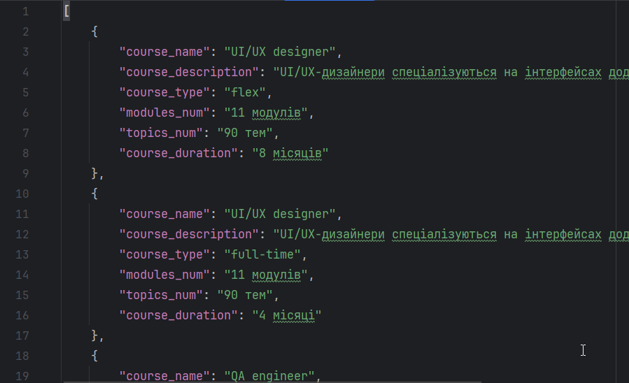

# tt_mate_academy
## Overview
This project implements a web scraper using Selenium to extract course information from the Mate Academy website. The scraper gathers key details about each course

### **(My thoughts)**
Although a combination of Scrapy and Selenium might offer more advanced features, this project focuses exclusively on Selenium to meet the specified requirements.

## Features
- **Scraping Course List:** Extracts the list of courses from the landing page.
- **Course Details:** Retrieves course name, short description, type (full-time or flex), number of modules, topics, and course duration for each course.
- **Data Output:** Saves the extracted data into a JSON file.

## Prerequisites to start project locally
- Download and install [ChromeDriver](https://sites.google.com/chromium.org/driver/)
- Python3.11+ (may support lower versions)

## Download, Installation and Start
1. Clone the repository:
    ```shell
    git clone https://github.com/panicua/tt_mate_academy.git
    cd tt_mate_academy
    ```
   
2. Create and activate venv (bash):
   ```shell
   python -m venv venv
   source venv/Scripts/activate
   ```

   Windows (Command Prompt):
   ```shell
   python -m venv venv
   venv\Scripts\activate
   ```
   
   Mac / Linux (Unix like systems):
   ```shell
   python3 -m venv venv
   source venv/bin/activate
   ```

3. Install requirements.txt to your venv:
   ```shell
   pip install -r requirements.txt
   ```

4. Run the Scraper:
   ```shell
   python -m selenium_scraper.scraper
   ```
   The results of the process will be saved in the result.json file by default.


## DEMO:
The result.json file contains the extracted data. See the example below:

